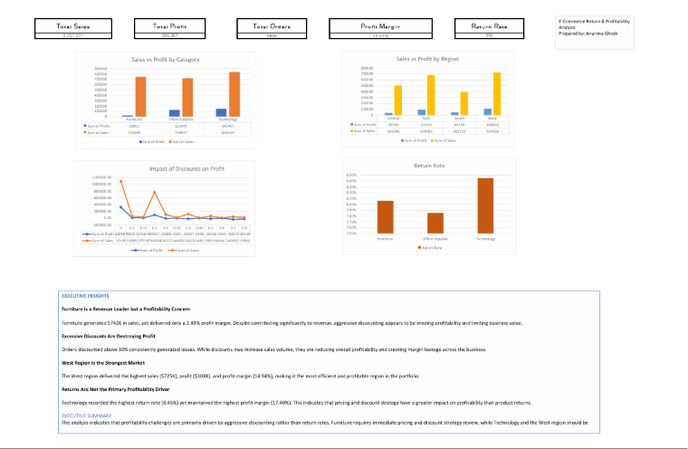

## Dashboard Preview

# E-Commerce Return & Profitability Analysis (Excel)

## Project Overview

This project analyzes e-commerce sales, profitability, discounts, and product returns using Microsoft Excel. The objective was to identify factors affecting profitability and provide actionable business recommendations through an interactive dashboard.

## Business Problem

An e-commerce company wanted to understand:

* Which product categories generate the highest revenue and profit
* How discounts impact profitability
* Which regions perform best and worst
* Whether product returns significantly affect business performance
* How profitability can be improved

## Dataset

Sample Superstore Dataset

Tables Used:

* Orders
* Returns
* People

## Tools & Techniques

* Microsoft Excel
* Data Cleaning
* Data Validation
* XLOOKUP
* Pivot Tables
* Pivot Charts
* KPI Dashboard
* Business Analysis
* Executive Reporting

## Key KPIs

| KPI           |  Value |
| ------------- | -----: |
| Total Sales   | $2.30M |
| Total Profit  |  $286K |
| Total Orders  |  9,994 |
| Profit Margin | 12.47% |
| Return Rate   |  8.00% |

## Key Findings

### Furniture Is a Revenue Leader but a Profitability Concern

Furniture generated $742K in sales but achieved only a 2.49% profit margin due to aggressive discounting.

### Discounts Above 30% Reduce Profitability

Orders with discounts above 30% consistently generated losses.

### West Region Is the Best Performing Market

West achieved the highest sales, profit, and profit margin.

### Returns Are Not the Primary Profitability Driver

Technology had the highest return rate but also delivered the highest profit margin.

## Business Recommendations

* Reduce discount levels on Furniture products.
* Limit discounting above 30%.
* Replicate successful practices from the West region.
* Focus growth efforts on high-margin Technology products.

## Dashboard Preview

(Add dashboard screenshot here)

## Skills Demonstrated

* Excel Data Analysis
* Business Analytics
* Dashboard Development
* KPI Reporting
* Data Visualization
* Business Storytelling
* Executive Communication
